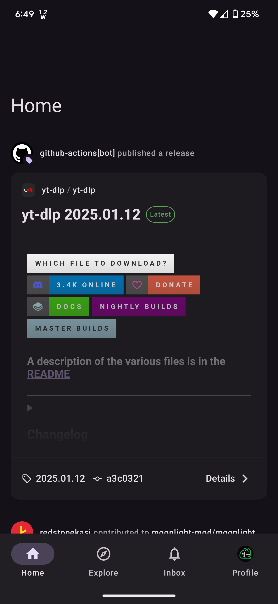
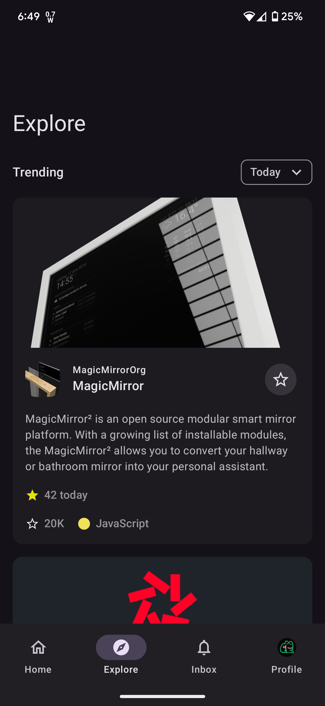

  
  
  # Gloom

  
  Material You Github client
  
  ---
  
  
  
  
   
  
  
  

|                                                                                                                                                                                                                                                       |                                                                                                                                                                                                                                                       |
|-------------------------------------------------------------------------------------------------------------------------------------------------------------------------------------------------------------------------------------------------------|-------------------------------------------------------------------------------------------------------------------------------------------------------------------------------------------------------------------------------------------------------|
| <picture><source media="(prefers-color-scheme: dark)" srcset=".github/images/Home.png" /><source media="(prefers-color-scheme: light)" srcset=".github/images/Home-Light.png" /></picture>          | <picture><source media="(prefers-color-scheme: dark)" srcset=".github/images/Explore.png" /><source media="(prefers-color-scheme: light)" srcset=".github/images/Explore-Light.png" /></picture> |
| <picture><source media="(prefers-color-scheme: dark)" srcset=".github/images/Profile.png" /><source media="(prefers-color-scheme: light)" srcset=".github/images/Profile-Light.png" /></picture> | <picture><source media="(prefers-color-scheme: dark)" srcset=".github/images/Repo.png" /><source media="(prefers-color-scheme: light)" srcset=".github/images/Repo-Light.png" /></picture>          |

## Roadmap

You can view the project roadmap [here](https://github.com/orgs/MateriiApps/projects/2)

Installation
---
 1. Download the [latest actions build](https://nightly.link/MateriiApps/Gloom/workflows/android/main/artifact.zip), if on PC then transfer the file over to your phone
 2. Unzip `artifact.zip`
 3. Make sure to allow install unknown apps
 4. Install the apk

Build
---

#### Prerequisites
  - [Git](https://git-scm.com/downloads)
  - [JDK 11](https://www.oracle.com/java/technologies/javase/jdk11-archive-downloads.html)
  - [Android SDK](https://developer.android.com/studio)

#### Instructions

1. Clone the repo
    - `git clone https://github.com/MateriiApps/Gloom.git && cd Gloom`
2. Build the project
    - Linux: `chmod +x gradlew && ./gradlew assembleDebug`
    - Windows: `./gradlew assembleDebug`
3. Install on device
    - [Enable usb debugging](https://developer.android.com/studio/debug/dev-options) and plug in your phone
    - Run `adb install app/build/outputs/apk/debug/app-debug.apk`

## Contributing

This is an open-source project, you can do so without any programming.

Here are a few things you can do:

- [Test and report issues](https://github.com/MateriiApps/Gloom/issues/new/choose)
- [Translate the app into your language](https://crowdin.com/project/gloom)
    
License
---
Gloom is licensed under the GNU General Public License v3.0

